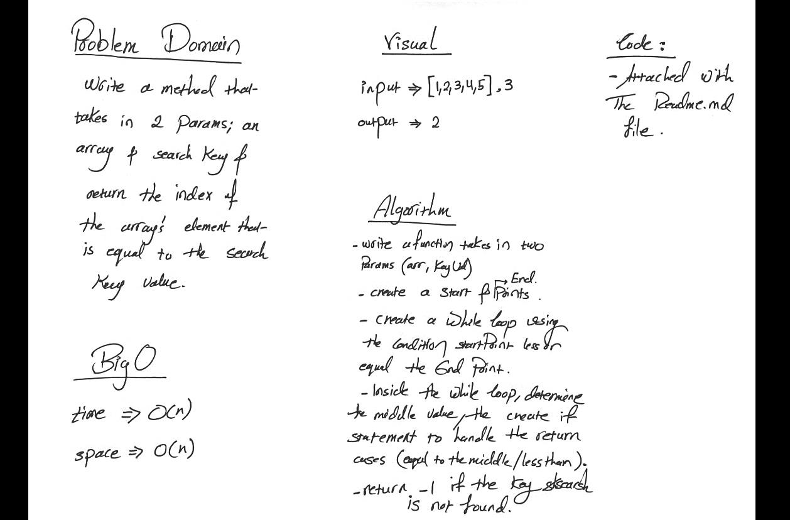
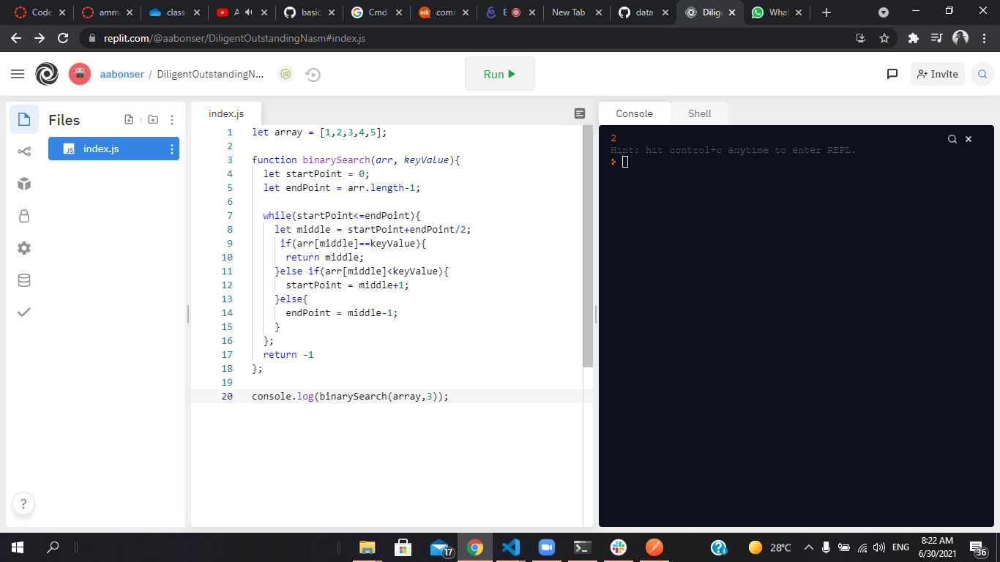

# Binary Search of Sorted Array
Write a method takes in 2 parameters: a sorted array and the search key, and return the index of the array’s element that is equal to the value of the search key.

## Whiteboard Process
   
   
