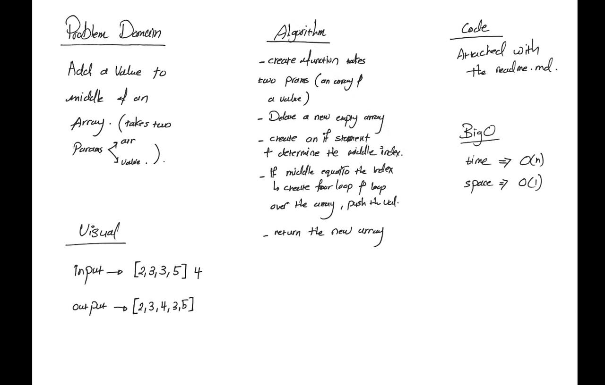
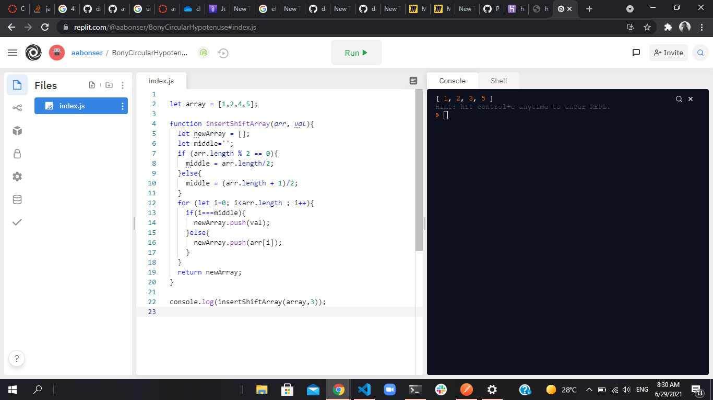

# Insert to Middle of an Array
takes in an array and a value to be added, add the value to the middle and return the new array back.

## Whiteboard Process
   
   

## Approach & Efficiency
<!-- What approach did you take? Discuss Why. What is the Big O space/time for this approach? -->