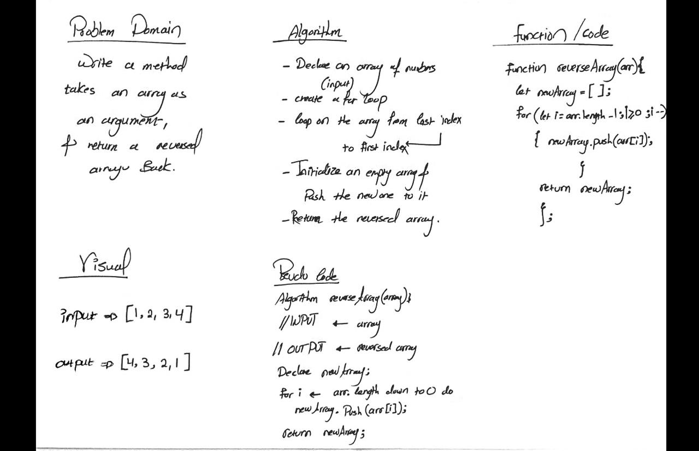

# Reverse an Array
Takes an array, reverse it, return the reversed array back.

## Whiteboard Process
   
 
## Approach & Efficiency
<!-- What approach did you take? Discuss Why. What is the Big O space/time for this approach? -->