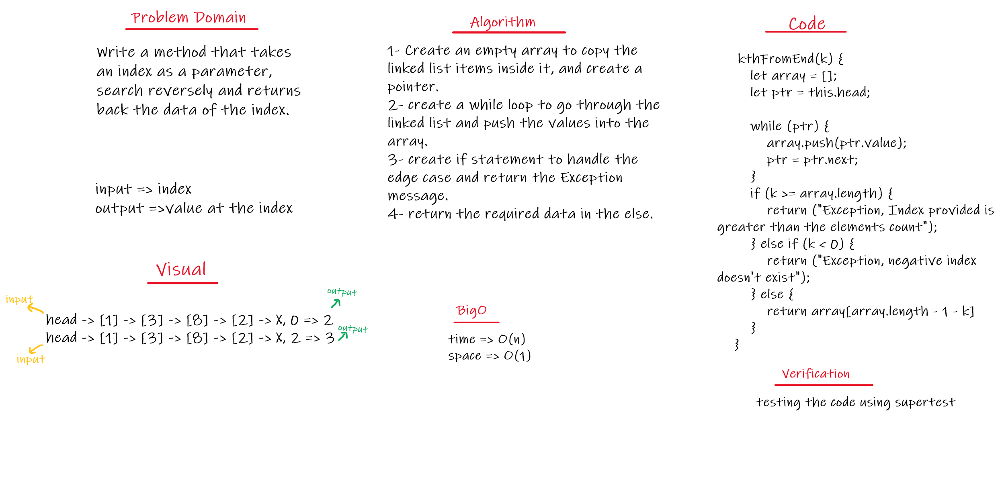

## Singly Linked List
- Is a type of linked list that is unidirectional, that is, it can be traversed in only one direction from head to the last node (tail).

## Challenge
- Write the following methods for the Linked List class:
- kth from end
    - argument: a number, k, as a parameter.
    - Return the node’s value that is k places from the tail of the linked list.
    - With having access to the Node class and all the properties on the Linked List class as well as the methods created in previous challenges.

## White Board
