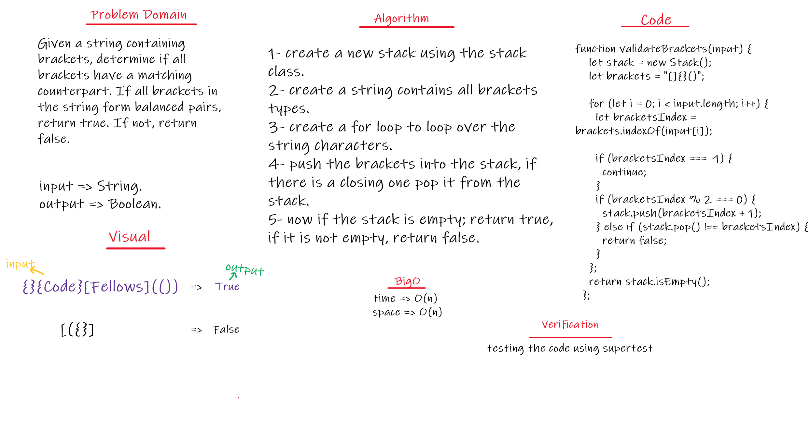

## Challenge
- Multi-bracket Validation.

## Approach & Efficiency
- Used the Node class which holds the data and a reference variable of type node to implement Stacks and queues with Time complexity of O(1) for methods and O(n) in the toString method .

## WhiteBoard 
