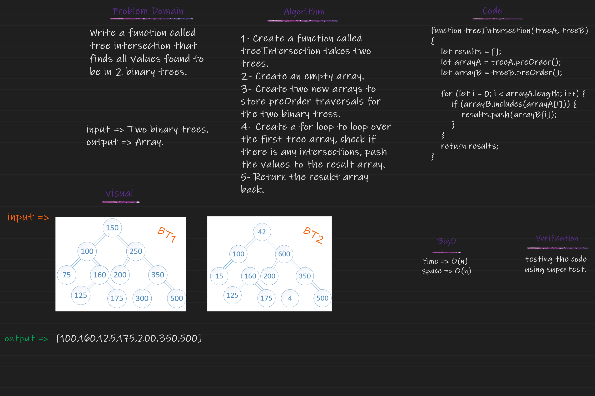

## Trees
Tree is a non-linear data structure that uses connected nodes to represen hierarch data and have a root node that have 0 or more children up to 2 children and that applies to every child node.

## Challenge
Find all values found to be in 2 binary trees

## WhiteBoard
